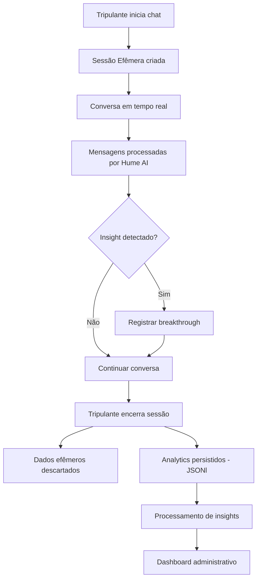

# 💬 MadBoat v2.0 - Sistema de Analytics de Chat

## 🎯 **Conceito: Chat Efêmero + Analytics Persistente**

### **🔄 Fluxo de Dados:**



## 📊 **Estrutura de Dados Analytics**

### **📄 Formato JSONl (Uma linha por evento):**

```jsonl
{"timestamp":"2025-01-09T14:30:00Z","event_type":"session_start","user_id":"uuid","persona":"CRIATIVO","alma_phase":"legado","session_duration_ms":null,"metadata":{"device":"desktop","browser":"chrome"}}

{"timestamp":"2025-01-09T14:30:15Z","event_type":"message","user_id":"uuid","message_type":"user","content_length":45,"intent":"questioning","emotion":{"primary":"curiosity","confidence":0.87,"secondary":"uncertainty"}}

{"timestamp":"2025-01-09T14:30:45Z","event_type":"message","user_id":"uuid","message_type":"genie","response_type":"socratic_question","method":"values_exploration","effectiveness_predicted":0.82}

{"timestamp":"2025-01-09T14:32:10Z","event_type":"breakthrough","user_id":"uuid","breakthrough_type":"values_clarity","trigger_message_id":"msg_123","insight_level":"high","description":"Clarity on core value: authenticity in business"}

{"timestamp":"2025-01-09T14:45:30Z","event_type":"session_end","user_id":"uuid","session_duration_ms":900000,"total_messages":24,"breakthroughs":2,"satisfaction_inferred":0.91}
```

## 🔍 **Tipos de Insights Extraíveis**

### **1. 📈 Insights Comportamentais:**

#### **🎯 Padrões de Uso:**
```json
{
  "user_engagement_patterns": {
    "peak_hours": ["19:00-21:00", "07:00-09:00"],
    "session_frequency": "3.2_per_week",
    "average_session_duration": "12.5_minutes",
    "preferred_interaction": "voice_80%_text_20%",
    "dropout_triggers": ["complex_questions", "technical_terms"]
  }
}
```

#### **🧠 Persona Insights:**
```json
{
  "persona_behavioral_analysis": {
    "ANALITICO": {
      "avg_session_length": "18.7_minutes",
      "questions_per_session": 8.3,
      "breakthrough_rate": "0.34_per_session",
      "resistance_topics": ["emotional_exploration"],
      "engagement_triggers": ["data_requests", "logical_frameworks"]
    },
    "CRIATIVO": {
      "avg_session_length": "22.1_minutes",
      "idea_generation_rate": "2.1_per_session", 
      "breakthrough_rate": "0.67_per_session",
      "resistance_topics": ["structured_planning"],
      "engagement_triggers": ["possibility_exploration", "metaphor_usage"]
    }
  }
}
```

### **2. 🎯 Insights de Metodologia A.L.M.A.:**

#### **📊 Efetividade por Fase:**
```json
{
  "alma_effectiveness": {
    "autenticidade": {
      "avg_completion_time": "3.2_weeks",
      "breakthrough_density": "0.43_per_session",
      "common_blockers": ["perfectionism", "overthinking"],
      "success_indicators": ["values_clarity", "purpose_articulation"]
    },
    "legado": {
      "trilha_distribution": {
        "trilha1": "45%",
        "trilha2": "32%", 
        "trilha3": "23%"
      },
      "trilha_success_rates": {
        "trilha1": "0.78",
        "trilha2": "0.65",
        "trilha3": "0.52"
      }
    }
  }
}
```

### **3. 💡 Insights de Conversação:**

#### **🗣️ Análise de Diálogo:**
```json
{
  "conversation_intelligence": {
    "question_effectiveness": {
      "socratic_questions": {
        "avg_effectiveness": 0.74,
        "best_performing": [
          "O que isso significa para você?",
          "Como você chegou a essa conclusão?",
          "Que valores estão por trás dessa escolha?"
        ]
      },
      "breakthrough_triggers": [
        "childhood_memories_exploration",
        "values_conflict_identification", 
        "future_self_visualization"
      ]
    },
    "emotional_journey": {
      "session_start_emotions": ["curiosity", "uncertainty", "hope"],
      "breakthrough_emotions": ["surprise", "clarity", "excitement"],
      "session_end_emotions": ["satisfaction", "determination", "gratitude"]
    }
  }
}
```

### **4. 📈 Insights de Negócio:**

#### **💼 Business Intelligence:**
```json
{
  "business_insights": {
    "user_retention": {
      "day_1": 0.85,
      "day_7": 0.67,
      "day_30": 0.43,
      "breakthrough_correlation": 0.78
    },
    "feature_usage": {
      "voice_chat": "78%",
      "text_chat": "56%",
      "both_modalities": "34%"
    },
    "methodology_completion": {
      "alma_phase_1": "0.82",
      "alma_phase_2": "0.61", 
      "alma_phase_3": "0.45",
      "alma_phase_4": "0.23"
    }
  }
}
```

## 🎛️ **Painel Administrativo - Estrutura de Dashboards**

### **📊 Dashboard Principal (`/admin/analytics/`):**

#### **🎯 Métricas em Tempo Real:**
- **Sessões Ativas**: Quantas conversas acontecendo agora
- **Breakthroughs Hoje**: Insights significativos nas últimas 24h  
- **Taxa de Engajamento**: % de usuários que retornam
- **Distribuição de Personas**: Gráfico de pizza com % de cada tipo

#### **📈 Tendências Semanais/Mensais:**
- **Gráfico de Linha**: Sessões por dia
- **Heatmap**: Horários de pico de uso
- **Funil de Conversão**: Da primeira sessão ao breakthrough
- **Net Promoter Score**: Derivado do sentiment das conversas

### **💬 Dashboard de Conversações (`/admin/analytics/conversations/`):**

#### **🔍 Análise Profunda:**

**Painel 1: Visão Geral**
```tsx
// Exemplo de componente
<ConversationAnalyticsDashboard>
  <MetricsRow>
    <MetricCard title="Total Conversas" value="1,847" change="+12%" />
    <MetricCard title="Avg. Duração" value="14.2 min" change="+3%" />
    <MetricCard title="Taxa Breakthrough" value="41%" change="+8%" />
    <MetricCard title="Satisfação" value="4.6/5" change="+0.2" />
  </MetricsRow>
  
  <ChartsRow>
    <ConversationHeatmap data={hourlyPatterns} />
    <BreakthroughTimeline data={breakthroughData} />
  </ChartsRow>
  
  <InsightsTable data={recentInsights} />
</ConversationAnalyticsDashboard>
```

**Painel 2: Análise Emocional**
- **Gráfico de Emoções**: Distribuição de sentimentos por sessão
- **Jornada Emocional**: Como emoções evoluem durante conversa
- **Triggers de Breakthrough**: Padrões que levam a insights
- **Alertas de Resistência**: Identificação de bloqueios emocionais

**Painel 3: Efetividade do Gênio**
- **Performance por Tipo de Pergunta**: Quais funcionam melhor
- **Análise de Response Time**: Tempo de resposta vs engagement  
- **Personalização por Persona**: Efetividade por tipo de usuário
- **A/B Testing Results**: Diferentes abordagens conversacionais

### **👥 Dashboard de Usuários (`/admin/analytics/users/`):**

#### **📊 Comportamento Individual:**

**Segmentação de Usuários:**
```json
{
  "user_segments": {
    "highly_engaged": {
      "criteria": "3+ sessions/week, 2+ breakthroughs",
      "count": 347,
      "characteristics": ["CRIATIVO majority", "evening_users", "voice_preferred"]
    },
    "explorers": {
      "criteria": "Many sessions, few breakthroughs",
      "count": 523,
      "characteristics": ["ANALITICO majority", "long_sessions", "question_heavy"]
    },
    "breakthrough_champions": {
      "criteria": "High breakthrough rate", 
      "count": 192,
      "characteristics": ["EMOTIVO majority", "morning_users", "quick_insights"]
    },
    "at_risk": {
      "criteria": "Declining engagement",
      "count": 89,
      "characteristics": ["INSEGURO majority", "short_sessions", "resistance_patterns"]
    }
  }
}
```

### **🎯 Dashboard de A.L.M.A. (`/admin/analytics/alma-progress/`):**

#### **📈 Metodologia Performance:**

**Análise de Fases:**
- **Funil de Progressão**: Quantos completam cada fase
- **Tempo por Fase**: Duração média em cada etapa
- **Pontos de Abandono**: Onde usuários param
- **Correlação Chat-Progresso**: Como conversas afetam avanço

**Otimização de Trilhas:**
- **Performance por Trilha**: Qual trilha tem maior sucesso
- **Personalização Sugerida**: Que trilha para que persona
- **Identificação de Gaps**: Onde metodologia pode melhorar

## 🔒 **Privacidade e Ética**

### **✅ Princípios de Coleta:**

1. **Anonimização**: Nenhum conteúdo literal de conversa armazenado
2. **Agregação**: Apenas padrões e métricas, nunca dados individuais identificáveis  
3. **Consentimento**: Tripulante autoriza explicitamente analytics
4. **Transparência**: Dashboard mostra o que é coletado
5. **Controle**: Tripulante pode pausar/interromper coleta a qualquer momento

### **📊 Dados Coletados vs Não Coletados:**

**✅ COLETADO (Anonimizado):**
- Duração de sessões
- Tipos de emoção detectados  
- Padrões de interação
- Efetividade de perguntas
- Momentos de breakthrough
- Progressão nas fases A.L.M.A.

**❌ NÃO COLETADO:**
- Conteúdo textual das conversas
- Informações pessoais específicas  
- Dados que permitam identificação individual
- Áudio das conversas
- Screenshots ou logs detalhados

## 🎯 **ROI do Sistema de Analytics**

### **💰 Valor de Negócio:**

1. **Personalização Inteligente**: Adaptar metodologia por persona
2. **Otimização de Retenção**: Identificar e prevenir churn
3. **Melhoria Contínua**: Refinar perguntas e abordagens do Gênio  
4. **Escalabilidade**: Automatizar identificação de padrões
5. **Inovação Guiada**: Desenvolver features baseadas em dados reais

### **📈 KPIs de Sucesso:**
- **Taxa de Breakthrough**: > 40% das sessões
- **Retenção D30**: > 45% usuários ativos após 30 dias
- **Satisfação**: > 4.5/5 baseado em sentiment analysis
- **Progressão A.L.M.A.**: > 60% completam pelo menos 2 fases
- **Eficiência Conversacional**: < 15 min para primeiro insight

---

**Este sistema transforma conversas efêmeras em insights estratégicos permanentes, respeitando privacidade e gerando valor real para otimização da metodologia MadBoat.** 🚀